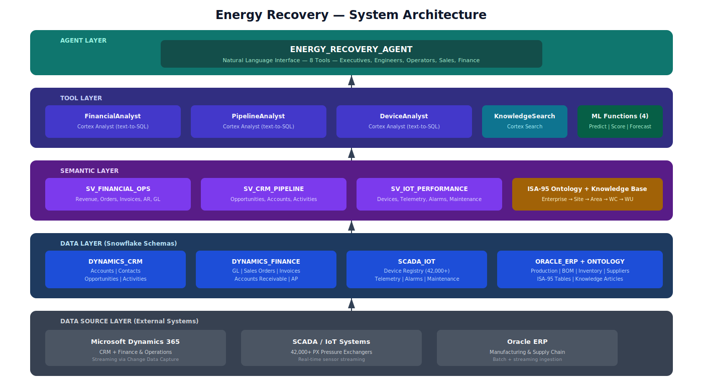
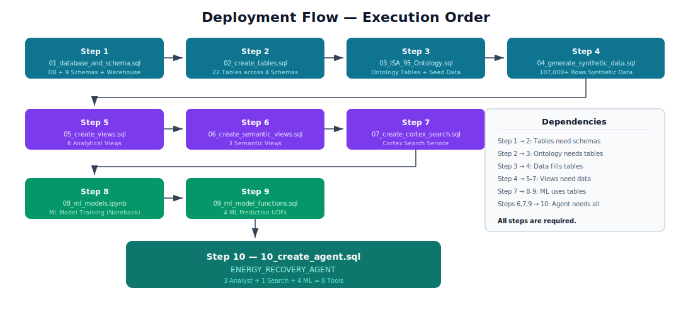
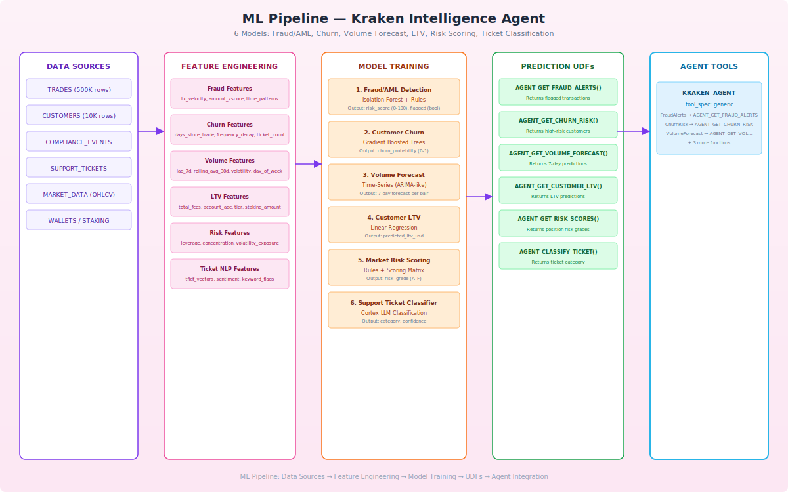
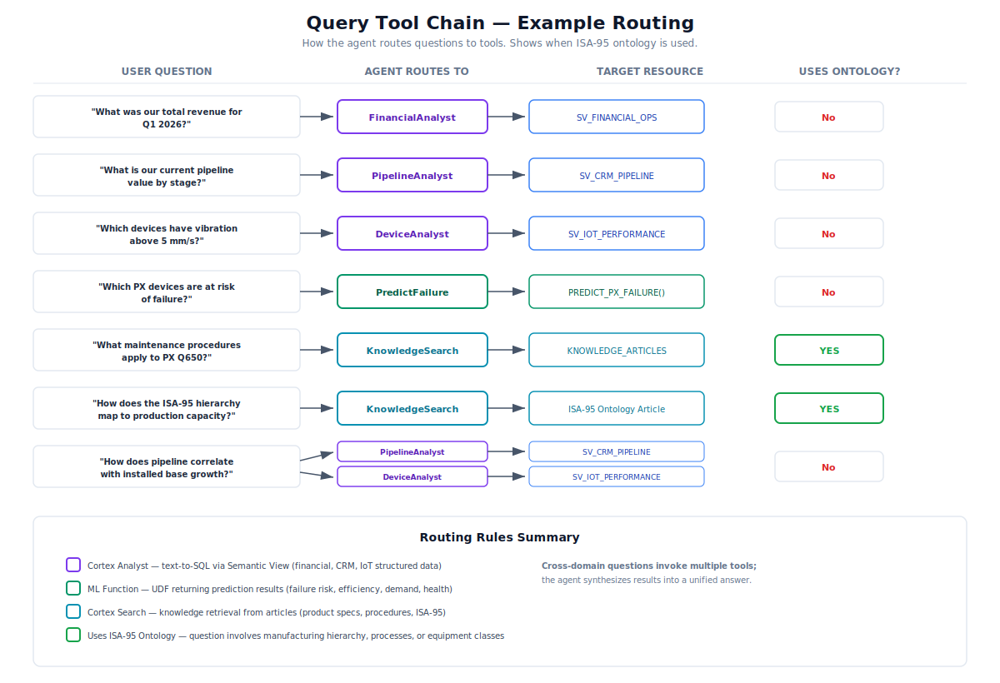

# Energy Recovery - Snowflake Intelligence Agent

## Overview

A complete Snowflake Intelligence architecture for **Energy Recovery, Inc.** (NASDAQ: ERII) — a global leader in energy recovery devices for industrial fluid flow applications. This agent enables natural language queries across Financial Operations, CRM/Sales Pipeline, IoT Device Performance, and Manufacturing data using Snowflake Cortex AI.

<html>
<table>
<tr><th>Component</th><th>Description</th></tr>
<tr><td>Database</td><td>ENERGY_RECOVERY_DB</td></tr>
<tr><td>Warehouse</td><td>ENERGY_RECOVERY_WH (Medium)</td></tr>
<tr><td>Agent</td><td>ENERGY_RECOVERY_AGENT</td></tr>
<tr><td>Semantic Views</td><td>3 (Financial, CRM, IoT)</td></tr>
<tr><td>Cortex Search</td><td>1 (Knowledge Base)</td></tr>
<tr><td>ML Functions</td><td>4 (Failure, Efficiency, Demand, Health)</td></tr>
<tr><td>Source Systems</td><td>Microsoft Dynamics, SCADA/IoT, Oracle ERP</td></tr>
<tr><td>Data Volume</td><td>107,000+ rows synthetic data</td></tr>
<tr><td>Installed Base</td><td>42,000+ PX devices modeled</td></tr>
</table>
</html>

---

## System Architecture

The architecture follows a layered approach: external data sources stream into Snowflake schemas, which feed semantic views and ML functions, all orchestrated by a single Cortex Agent.



---

## Company Context

Energy Recovery designs and manufactures PX Pressure Exchanger devices that recover up to 98% of otherwise wasted pressure energy in reverse osmosis desalination plants. The company is expanding into industrial wastewater treatment and CO2 transcritical refrigeration.

<html>
<table>
<tr><th>Attribute</th><th>Detail</th></tr>
<tr><td>Founded</td><td>1992, San Leandro, California</td></tr>
<tr><td>Stock</td><td>NASDAQ: ERII (~$19.50, Market Cap ~$1.15B)</td></tr>
<tr><td>FY2025 Revenue</td><td>$135.2M (+5.1% YoY)</td></tr>
<tr><td>FY2026 Guidance</td><td>$135M–$145M revenue, 67%–69% gross margin</td></tr>
<tr><td>Employees</td><td>~230</td></tr>
<tr><td>Installed Base</td><td>42,000+ PX devices across 6 continents</td></tr>
<tr><td>Core Technology</td><td>PX Pressure Exchanger — 98% energy transfer efficiency</td></tr>
<tr><td>Key Markets</td><td>MENA, Asia-Pacific, Europe, Americas</td></tr>
</table>
</html>

### Products & Services

<html>
<table>
<tr><th>Product</th><th>Application</th><th>Key Specification</th></tr>
<tr><td>PX Q650</td><td>Large-scale SWRO desalination</td><td>68.2 m³/h, up to 98.7% efficiency, 82.7 bar</td></tr>
<tr><td>PX Q400</td><td>Mid-scale SWRO desalination</td><td>45.4 m³/h, up to 98% efficiency</td></tr>
<tr><td>PX-220</td><td>Smaller desalination plants</td><td>Compact form factor, 96.5% efficiency</td></tr>
<tr><td>PX G1300</td><td>CO2 transcritical refrigeration</td><td>Launched April 2026, pressures up to 130 bar</td></tr>
<tr><td>Aftermarket Services</td><td>Maintenance & support</td><td>Seal kits, bearings, rotor replacement</td></tr>
</table>
</html>

### Competitors

<html>
<table>
<tr><th>Competitor</th><th>Description</th><th>Positioning vs. Energy Recovery</th></tr>
<tr><td>Danfoss</td><td>APP pumps, iSave energy recovery</td><td>Broader portfolio, less specialized in isobaric recovery</td></tr>
<tr><td>Flowserve</td><td>Flow control systems (pumps, valves, seals)</td><td>Comprehensive solutions, competes on breadth</td></tr>
<tr><td>Sulzer</td><td>Fluid engineering (pumps, agitators, mixers)</td><td>Global service network, lacks PX-level efficiency</td></tr>
</table>
</html>

---

## Deployment Flow

Execute SQL files in this exact order. Each step depends on the previous steps completing successfully.



### Execution Steps

<html>
<table>
<tr><th>Step</th><th>File</th><th>What It Creates</th></tr>
<tr><td>1</td><td>sql/setup/01_database_and_schema.sql</td><td>Database (ENERGY_RECOVERY_DB), 9 schemas, warehouse</td></tr>
<tr><td>2</td><td>sql/setup/02_create_tables.sql</td><td>22 tables across 4 source-system schemas</td></tr>
<tr><td>3</td><td>sql/setup/03_ISA_95_Ontology.sql</td><td>ISA-95 ontology tables + knowledge articles + seed data</td></tr>
<tr><td>4</td><td>sql/data/04_generate_synthetic_data.sql</td><td>107,000+ rows of realistic synthetic data</td></tr>
<tr><td>5</td><td>sql/views/05_create_views.sql</td><td>6 analytical views in ANALYTICS schema</td></tr>
<tr><td>6</td><td>sql/views/06_create_semantic_views.sql</td><td>3 semantic views for Cortex Analyst</td></tr>
<tr><td>7</td><td>sql/search/07_create_cortex_search.sql</td><td>Cortex Search service over knowledge base</td></tr>
<tr><td>8</td><td>notebooks/08_ml_models.ipynb</td><td>ML model training notebook (Snowpark)</td></tr>
<tr><td>9</td><td>sql/models/09_ml_model_functions.sql</td><td>4 ML prediction UDFs</td></tr>
<tr><td>10</td><td>sql/agent/10_create_agent.sql</td><td>ENERGY_RECOVERY_AGENT with 8 tools</td></tr>
</table>
</html>

---

## Data Sources

The architecture models data as if streaming from real enterprise systems via CDC and IoT pipelines.

<html>
<table>
<tr><th>Source System</th><th>Schema</th><th>Data Domain</th><th>Key Tables</th><th>Row Count</th></tr>
<tr><td>Microsoft Dynamics CRM</td><td>DYNAMICS_CRM</td><td>Sales & Accounts</td><td>ACCOUNTS, CONTACTS, OPPORTUNITIES, ACTIVITIES</td><td>~4,200</td></tr>
<tr><td>Microsoft Dynamics F&O</td><td>DYNAMICS_FINANCE</td><td>Financial Operations</td><td>GENERAL_LEDGER, SALES_ORDERS, INVOICES, AR, AP</td><td>~7,500</td></tr>
<tr><td>SCADA / IoT Systems</td><td>SCADA_IOT</td><td>Device Telemetry</td><td>DEVICE_REGISTRY, DEVICE_TELEMETRY, ALARMS, MAINTENANCE_LOGS</td><td>~97,700</td></tr>
<tr><td>Oracle ERP</td><td>ORACLE_ERP</td><td>Manufacturing & Supply Chain</td><td>PRODUCTION_ORDERS, BOM, INVENTORY, SUPPLIERS, PURCHASE_ORDERS</td><td>~1,820</td></tr>
</table>
</html>

---

## ISA-95 Ontology

The manufacturing data model follows the ISA-95 (IEC 62264) standard for enterprise-control system integration. This provides a structured vocabulary for the agent to understand manufacturing operations.

<html>
<table>
<tr><th>Level</th><th>ISA-95 Entity</th><th>Energy Recovery Mapping</th><th>Examples</th></tr>
<tr><td>0</td><td>Enterprise</td><td>Energy Recovery, Inc.</td><td>NASDAQ: ERII, San Leandro HQ</td></tr>
<tr><td>1</td><td>Site</td><td>Manufacturing & regional sites</td><td>San Leandro MFG, Dubai Office, Shanghai Service Center</td></tr>
<tr><td>2</td><td>Area</td><td>Functional production areas</td><td>Ceramic Manufacturing, CNC Machining, Assembly, Testing, Packaging</td></tr>
<tr><td>3</td><td>Work Center</td><td>Production cells/lines</td><td>Ceramic Forming, Sintering, CNC Turning, Final Assembly</td></tr>
<tr><td>4</td><td>Work Unit</td><td>Individual machines</td><td>Kiln A (Nabertherm HT-1700), CNC Lathe T-1 (DMG Mori NLX-2500)</td></tr>
</table>
</html>

Additional ISA-95 models included:
- **Material Model** — 10 material classes (ceramic powder, duplex steel, seals, finished goods)
- **Equipment Model** — 10 equipment classes (presses, kilns, CNC, robots, test rigs)
- **Personnel Model** — 8 personnel classes (technicians, engineers, inspectors)
- **Process Segments** — 12-step PX manufacturing flow (raw material → packaging)

---

## Agent Tools & Capabilities

The `ENERGY_RECOVERY_AGENT` has 8 tools spanning structured data, unstructured knowledge, and ML predictions:

<html>
<table>
<tr><th>Tool Name</th><th>Type</th><th>Target</th><th>Purpose</th></tr>
<tr><td>FinancialAnalyst</td><td>Cortex Analyst</td><td>SV_FINANCIAL_OPS</td><td>Revenue, orders, invoices, AR/AP, GL queries</td></tr>
<tr><td>PipelineAnalyst</td><td>Cortex Analyst</td><td>SV_CRM_PIPELINE</td><td>Opportunities, accounts, win rates, activities</td></tr>
<tr><td>DeviceAnalyst</td><td>Cortex Analyst</td><td>SV_IOT_PERFORMANCE</td><td>Device telemetry, alarms, maintenance, uptime</td></tr>
<tr><td>KnowledgeSearch</td><td>Cortex Search</td><td>KNOWLEDGE_ARTICLES</td><td>Product specs, procedures, ISA-95, troubleshooting</td></tr>
<tr><td>PredictFailure</td><td>ML Function</td><td>PREDICT_PX_FAILURE()</td><td>30-day failure risk prediction</td></tr>
<tr><td>ScoreEfficiency</td><td>ML Function</td><td>SCORE_ENERGY_EFFICIENCY()</td><td>Efficiency gap analysis vs design specs</td></tr>
<tr><td>ForecastDemand</td><td>ML Function</td><td>FORECAST_DEMAND()</td><td>Next quarter demand by product/region</td></tr>
<tr><td>EquipmentHealth</td><td>ML Function</td><td>CALCULATE_EQUIPMENT_HEALTH()</td><td>Composite health scoring (0-100)</td></tr>
</table>
</html>

---

## ML Models

Four ML prediction functions are deployed as SQL UDFs, callable by the agent to answer predictive questions.



---

## Query Tool Chain

The agent routes natural language questions to the appropriate tool based on intent. Knowledge base and ISA-95 ontology questions go through Cortex Search; structured data questions go through Cortex Analyst; predictive questions go through ML functions.



---

## Semantic Views

Three semantic views power the Cortex Analyst text-to-SQL capability:

### SV_FINANCIAL_OPS
- **Tables**: SALES_ORDERS, INVOICES, ACCOUNTS_RECEIVABLE, GENERAL_LEDGER
- **Metrics**: Total revenue, order count, avg order value, total outstanding AR, net income
- **Dimensions**: Product line, region, customer, sales rep, fiscal year/quarter, aging bucket, department

### SV_CRM_PIPELINE
- **Tables**: OPPORTUNITIES, ACCOUNTS, ACTIVITIES
- **Metrics**: Total pipeline, weighted pipeline, opportunity count, avg deal size, win rate
- **Dimensions**: Stage, product interest, application, region, sales rep, competitor, account tier

### SV_IOT_PERFORMANCE
- **Tables**: DEVICE_REGISTRY, DEVICE_TELEMETRY, ALARMS, MAINTENANCE_LOGS
- **Metrics**: Avg energy recovery, avg vibration, device count, alarm count, total maintenance cost, total downtime
- **Dimensions**: Device model, product line, installation site, region, alarm severity, maintenance type, failure mode

---

## Sample Questions

The agent handles 38+ test questions across all domains. Examples:

**Financial Operations**
- "What was our total revenue for Q1 2026?"
- "How does gross margin compare across product lines?"
- "What is our current AR aging breakdown by region?"

**CRM / Sales Pipeline**
- "What is our current pipeline value by stage?"
- "What is our win rate against Danfoss?"
- "Which opportunities are expected to close this quarter with amount > $1M?"

**IoT / Device Performance**
- "Which PX devices are at risk of failure in the next 30 days?"
- "What is the average energy recovery efficiency by device model?"
- "Show me alarm frequency trends by severity"

**Cross-Domain & Knowledge**
- "What maintenance procedures apply to PX Q650 devices?"
- "How does our ISA-95 hierarchy map to production capacity?"
- "What is the demand forecast for next quarter by product line?"

See [docs/questions.md](docs/questions.md) for the full list of 38 test questions with expected tool routing.

---

## Project Structure

```
/
├── README.md                           # This file
├── docs/
│   ├── AGENT_SETUP.md                 # Step-by-step agent configuration guide
│   ├── DEPLOYMENT_SUMMARY.md          # Current deployment status
│   ├── questions.md                   # 38 complex test questions
│   └── images/
│       ├── architecture.svg           # System architecture diagram
│       ├── deployment_flow.svg        # Deployment workflow diagram
│       ├── ml_models.svg              # ML models — questions answered
│       └── query_tool_chain.svg       # Query routing examples
├── notebooks/
│   └── 08_ml_models.ipynb             # ML model training notebook
└── sql/
    ├── setup/
    │   ├── 01_database_and_schema.sql # Database, schemas, warehouse
    │   ├── 02_create_tables.sql       # All table definitions
    │   └── 03_ISA_95_Ontology.sql     # ISA-95 Ontology tables and data
    ├── data/
    │   └── 04_generate_synthetic_data.sql # Synthetic data generation
    ├── views/
    │   ├── 05_create_views.sql        # Analytical views
    │   └── 06_create_semantic_views.sql # Semantic views for Cortex Analyst
    ├── search/
    │   └── 07_create_cortex_search.sql # Cortex Search services
    ├── models/
    │   └── 09_ml_model_functions.sql  # ML prediction UDFs
    └── agent/
        └── 10_create_agent.sql        # Agent creation script
```

---

## Snowflake Value Proposition for Energy Recovery

<html>
<table>
<tr><th>Value Driver</th><th>Description</th></tr>
<tr><td>Data Warehouse Consolidation</td><td>Replace BigQuery + Redshift + SQL Server + Oracle with a single Snowflake platform across AWS, Azure, and GCP</td></tr>
<tr><td>IoT & Predictive Maintenance</td><td>Scale analytics for 42,000+ PX devices with real-time telemetry, predictive failure models, and automated alerting</td></tr>
<tr><td>Supply Chain & Manufacturing</td><td>Unified platform for demand forecasting, inventory optimization, and production planning as the company expands into refrigeration and wastewater</td></tr>
<tr><td>AI/ML Workloads</td><td>Cortex AI capabilities accelerate process optimization and quality control without separate ML infrastructure</td></tr>
<tr><td>Natural Language Analytics</td><td>Cortex Agent enables any user to ask questions of financial, CRM, and IoT data without SQL knowledge</td></tr>
</table>
</html>

---

## Requirements

- Snowflake account with Cortex AI features enabled
- ACCOUNTADMIN or role with CREATE DATABASE, CREATE WAREHOUSE, CREATE AGENT privileges
- Cortex Agent, Cortex Analyst, and Cortex Search services enabled
- Region with Cortex AI availability (AWS US-West-2, US-East-1, or equivalent)

---

## Additional Documentation

- [Agent Setup Guide](docs/AGENT_SETUP.md) — Step-by-step configuration instructions
- [Deployment Summary](docs/DEPLOYMENT_SUMMARY.md) — Current deployment status and object inventory
- [Test Questions](docs/questions.md) — 38 test questions with expected tool routing
